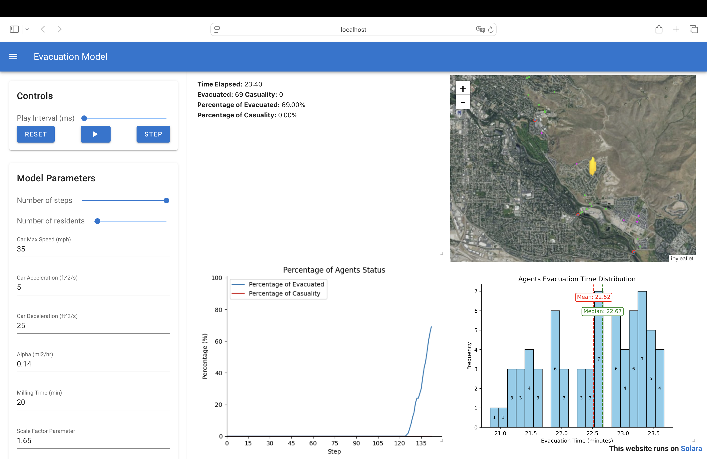

# 1. Overview
This project simulates an evacuation scenario using the Mesa framework. The model demonstrates how agents can navigate through an environment to reach safety.

# 2. Model GUI

The GUI includes the following components:

- **Model Parameters Control**: Allows users to adjust various parameters of the simulation, such as agent behavior, fire spread rate, and evacuation strategies.
- **Map**: Displays the spatial layout of the environment, including buildings, roads, shelters, and fire spread.
- **Model Simulation Text**: Provides real-time textual updates about the simulation, such as the number of agents evacuated and fire progression.
- **Model Simulation Plot**: Visualizes key metrics and trends during the simulation, such as evacuation rates and fire coverage over time.

# 3. How to Setup

Follow these steps to set up and run the evacuation simulation:

## 3.1 Install Dependencies
Ensure you have Python installed on your system. Then, install the required dependencies using `pip`:

```bash
pip install -r requirements.txt
```

This will install all the necessary Python packages listed in the `requirements.txt` file.

## 3.2 Prepare the Dataset
Place the dataset files in the `data/pcs` directory. The dataset should include the following files:

- `buildings.shp`
- `fire_arrival_time.asc`
- `fire_ignition.shp`
- `population_distribution.shp`
- `road_network.shp`
- `shelters.shp`

Ensure the files are correctly formatted and located in the specified directory.

## 3.3 Run the Simulation
Execute the `run.sh` script to start the simulation:

```bash
bash run.sh
```

This script will initialize the model, load the dataset, and launch the simulation. Ensure the `cache` folder is writable to allow the creation of the network cache during the first run.

You are now ready to explore the evacuation simulation!

# 4. Dataset
The dataset used in this project is located in the `data/pcs` directory. It contains preprocessed data that represents the environment and agent configurations for the evacuation simulation. Ensure the dataset is properly placed in this directory before running the model.

## 4.1 Data Description
The dataset includes the following files:

- **buildings.shp**: A shapefile containing the spatial locations and attributes of buildings in the simulation area.
- **fire_arrival_time.asc**: An ASCII grid file representing the time it takes for the fire to reach different locations in the environment.
- **fire_ignition.shp**: A shapefile indicating the points of fire ignition within the simulation area.
- **population_distribution.shp**: A shapefile detailing the distribution of the population across the simulation area.
- **road_network.shp**: A shapefile representing the road network used by agents for navigation.
- **shelters.shp**: A shapefile marking the locations of shelters available for agents to evacuate to.

Ensure these files are correctly placed in the `data/pcs` directory before running the simulation.

# 5. About Cache
The `cache` folder contains the network cache file. When you run the model for the first time, it builds the network cache and stores it in this folder. This cache is used to optimize subsequent runs of the model by avoiding the need to rebuild the network structure each time. Ensure the `cache` folder is writable and accessible during the simulation.

# 6. Code Structure

The project is organized into several key Python files, each responsible for a specific aspect of the simulation:

- **agents.py**: Defines the agent classes used in the simulation. Each agent represents an individual or entity in the evacuation scenario, with attributes and behaviors such as movement, decision-making, and interaction with the environment.

- **cell.py**: Contains the logic for individual cells in the simulation grid. Cells represent discrete areas of the environment and store information such as terrain type, fire status, and agent occupancy.

- **space.py**: Implements the spatial representation of the environment. This file manages the grid structure, spatial relationships, and interactions between agents and their surroundings.

- **model.py**: The core of the simulation, this file defines the overall model structure, including the initialization of agents, environment setup, and simulation step logic. It orchestrates the interactions between agents and the environment.

- **app.py**: Provides the graphical user interface (GUI) for the simulation. This file allows users to visualize the evacuation process, interact with the model, and control simulation parameters.

Each file plays a crucial role in ensuring the simulation runs efficiently and accurately. Together, they form the backbone of the evacuation model.
